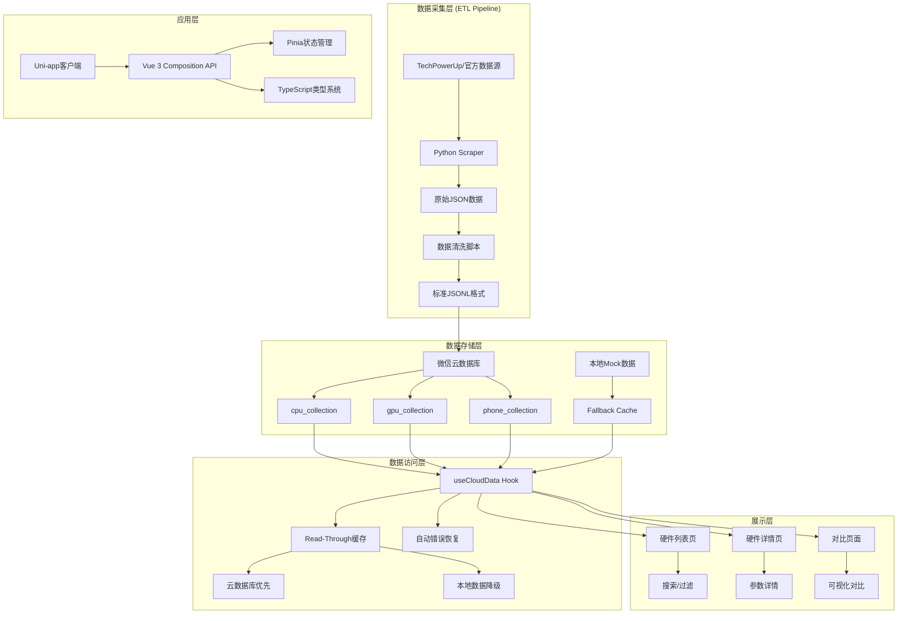
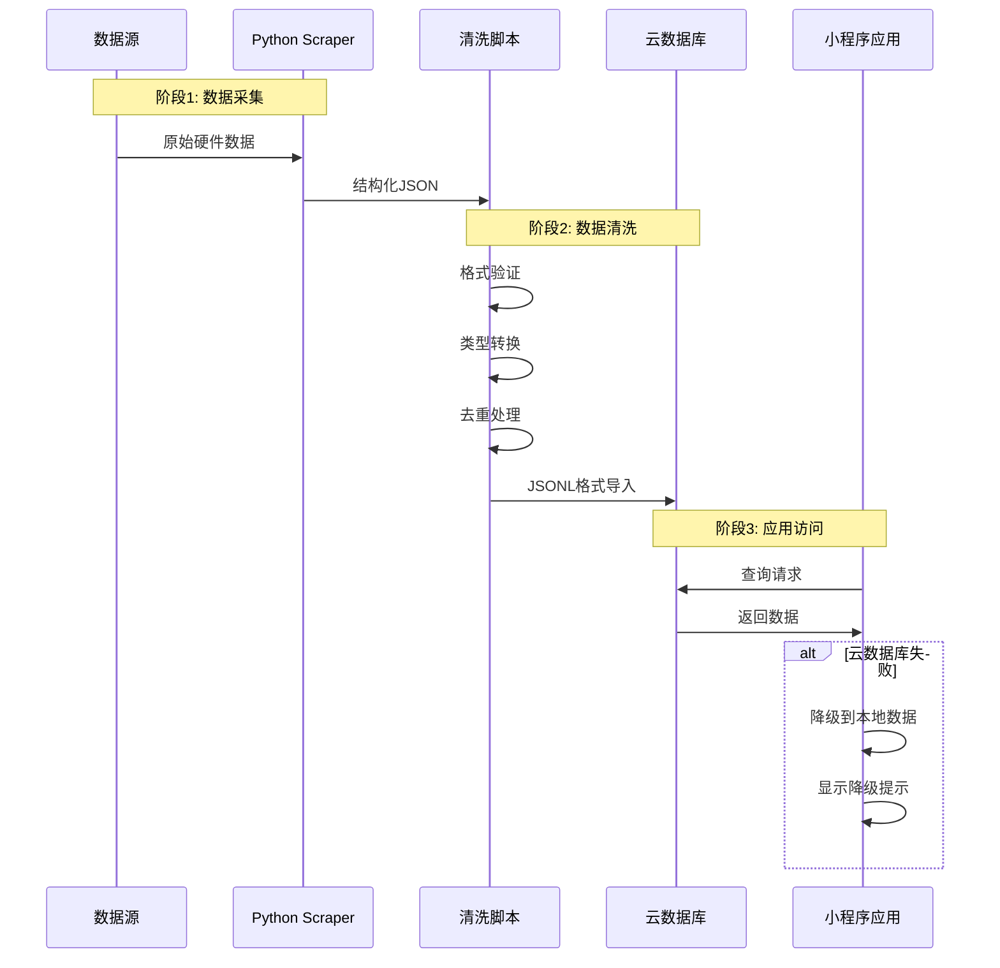

# 🚀 Hardware Assistant (硬件参数小助手)

<div align="center">


**面向硬件爱好者的参数查询与对比工具** · **专为后端/内核开发者设计的前端架构**

[项目概述](#-项目概述) · [系统架构](#-系统架构) · [技术栈](#-技术栈) · [快速开始](#-快速开始) · [数据管道](#-数据管道)

</div>

## 📋 项目概述

**Hardware Assistant** 是一个专业的硬件参数查询与对比微信小程序，专为硬件爱好者、DIY玩家和IT专业人士设计。项目采用**后端思维的前端架构**，强调类型安全、数据一致性和工程化标准。

### 🎯 核心特性

- **📊 多品类硬件支持**: CPU、显卡、手机三大品类，结构化参数展示
- **🔍 智能搜索**: 支持型号、品牌、描述的多字段模糊搜索
- **⚖️ 专业对比**: 多硬件横向对比，可视化参数差异
- **☁️ 云原生架构**: 微信云数据库 + 本地缓存双数据源
- **📱 原生体验**: 微信小程序原生组件，60fps流畅交互
- **🔧 工程化标准**: TypeScript严格模式，DDD架构思想

## 🏗️ 系统架构

### 架构图



### 架构特点

1. **分层架构**: 清晰的关注点分离，每层职责单一
2. **双数据源**: 云数据库为主，本地数据为降级方案
3. **Read-Through缓存**: 智能数据访问策略，优先云数据
4. **错误恢复**: 多层错误处理，保证应用可用性
5. **类型驱动**: TypeScript类型定义贯穿全栈

## 🛠️ 技术栈

### 前端框架
- **Uni-app 3.0.0**: 跨端开发框架，一次开发多端部署
- **Vue 3.4.21**: Composition API，响应式编程范式
- **TypeScript 4.9.5**: 严格模式，零`any`类型承诺
- **Vite 5.2.8**: 下一代前端构建工具

### UI组件库
- **wot-design-uni 1.14.0**: 微信小程序原生风格组件库
- **SCSS**: CSS预处理器，支持`rpx`响应式单位
- **Flexbox布局**: 现代CSS布局方案

### 状态管理
- **Pinia 3.0.4**: Vue官方状态管理库
- **Composition API**: 逻辑复用和状态封装

### 数据层
- **微信云开发**: Serverless云数据库
- **本地JSON缓存**: 离线数据支持
- **Python ETL管道**: 数据采集和清洗

### 开发工具
- **ESLint + TypeScript**: 代码质量和类型检查
- **Git Hooks**: 提交前检查和格式化
- **VS Code配置**: 统一的开发环境

## 📁 项目结构概览

```
hardware-assistant/
├── .clinerules                    # 项目编码规范和架构标准
├── package.json                   # 依赖管理和脚本配置
├── vite.config.ts                 # Vite构建配置
├── tsconfig.json                  # TypeScript编译配置
├── README.md                      # 项目主文档
├── PROJECT_ARCHITECTURE_ANALYSIS.md # 详细架构分析文档
│
├── scripts/                       # 数据管道脚本（Python）
│   ├── scrapers/                  # 数据采集器
│   │   ├── web_scraper.py         # 通用爬虫基类
│   │   ├── cpu.py                 # CPU数据采集器
│   │   ├── gpu.py                 # GPU数据采集器
│   │   └── phone.py               # 手机数据采集器
│   ├── update_db.py               # 数据库更新主控制器
│   ├── convert_to_jsonl.py        # JSON转JSONL格式转换
│   ├── fix_json_for_cloud.py      # 云数据库格式修复
│   └── backups/                   # 数据备份目录
│
├── src/                           # 前端源代码
│   ├── types/                     # TypeScript类型定义层
│   │   └── hardware.ts            # 硬件数据结构定义（核心契约）
│   │
│   ├── composables/               # 业务逻辑层
│   │   └── useCloudData.ts        # 云数据访问Hook（核心数据层）
│   │
│   ├── stores/                    # 状态管理层
│   │   └── compare.ts             # 硬件对比状态管理
│   │
│   ├── pages/                     # 页面组件层
│   │   ├── index/                 # 首页（硬件列表和搜索）
│   │   ├── detail/                # 详情页（规格展示）
│   │   ├── compare/               # 对比页（横向对比）
│   │   ├── ranking/               # 性能排行页
│   │   └── debug/                 # 调试页面（云数据库诊断）
│   │
│   ├── mock/                      # 本地模拟数据（降级数据源）
│   │   ├── cpu_data.json          # CPU数据（30条）
│   │   ├── gpu_data.json          # GPU数据（25条）
│   │   └── phone_data.json        # 手机数据（25条）
│   │
│   ├── styles/                    # 样式文件
│   │   ├── wot-design-uni.scss    # UI组件库样式覆盖
│   │   └── fix-font-loading.scss  # 字体加载修复
│   │
│   ├── utils/                     # 工具函数
│   ├── static/                    # 静态资源
│   │   └── tabbar/                # 底部导航栏图标
│   └── App.vue                    # 应用根组件
│
├── skills/                        # 项目技能和架构文档
│   ├── ARCHITECTURE.md            # 详细系统架构文档
│   ├── SKILLS.md                  # 技术能力清单
│   ├── SCRAPER_SYSTEM_REFACTOR.md # 爬虫系统重构总结
│   └── references/                # 参考文档
│
└── dist/                          # 构建输出目录
```

### 目录职责说明

1. **`scripts/`** - 数据管道层：负责数据采集、清洗、转换和导入
2. **`src/types/`** - 类型定义层：定义全局数据契约，确保类型安全
3. **`src/composables/`** - 业务逻辑层：封装可复用的业务逻辑
4. **`src/stores/`** - 状态管理层：管理应用全局状态
5. **`src/pages/`** - 页面展示层：负责UI渲染和用户交互
6. **`src/mock/`** - 数据降级层：提供本地数据作为降级方案
7. **`skills/`** - 文档和知识库：包含项目技术文档和架构说明

> **详细架构分析**：请查看 [PROJECT_ARCHITECTURE_ANALYSIS.md](PROJECT_ARCHITECTURE_ANALYSIS.md) 获取完整的项目架构分析报告

## 🎯 核心功能模块

### 1. 硬件列表模块 (`src/pages/index/index.vue`)
- **功能**：硬件浏览和搜索，支持CPU/显卡/手机分类展示
- **特点**：智能搜索、分页加载、对比功能、骨架屏优化

### 2. 性能排行模块 (`src/pages/ranking/index.vue`)
- **功能**：硬件性能排行榜，综合评分算法
- **特点**：金银铜牌标识、类型切换、点击跳转详情

### 3. 硬件对比模块 (`src/pages/compare/index.vue`)
- **功能**：专业级硬件参数对比，可视化差异展示
- **特点**：左右分栏对比、参数差异可视化、智能参数解析

### 4. 硬件详情模块 (`src/pages/detail/index.vue`)
- **功能**：展示硬件完整规格参数
- **特点**：品牌主题色设计、完整参数列表、对比添加功能

### 5. 调试诊断模块 (`src/pages/debug/index.vue`)
- **功能**：云数据库诊断工具
- **特点**：环境状态检查、集合验证、数据加载测试

### 6. 数据访问模块 (`src/composables/useCloudData.ts`)
- **功能**：统一数据访问接口，智能降级机制
- **特点**：Read-Through缓存策略、分页搜索排序一体化、错误处理

### 7. 状态管理模块 (`src/stores/compare.ts`)
- **功能**：管理硬件对比状态，跨页面同步
- **特点**：Pinia状态管理、业务规则约束、状态持久化

### 8. 数据管道模块 (`scripts/`目录)
- **功能**：自动化数据采集、清洗和更新
- **特点**：模块化爬虫设计、优雅降级机制、完整数据验证

> **详细模块说明**：请查看 [PROJECT_ARCHITECTURE_ANALYSIS.md#五主要功能模块](PROJECT_ARCHITECTURE_ANALYSIS.md#五主要功能模块) 获取完整的功能模块分析

## 📊 数据管道

### 数据采集流程



### 数据类型定义

项目采用**Schema-First**设计理念，所有数据结构在`src/types/hardware.ts`中明确定义：

```typescript
// 基础硬件接口
interface BaseHardware {
  id: string;
  model: string;
  brand: 'Intel' | 'AMD' | 'NVIDIA' | 'Apple' | 'Xiaomi' | 'Huawei' | 'Samsung' | '其他';
  releaseDate: string;  // ISO格式
  price: number;        // 人民币
  description?: string;
}

// CPU专用接口
interface CpuSpecs extends BaseHardware {
  cores: string;        // 如 "8P+16E"
  baseClock: number;    // GHz
  boostClock: number;   // GHz
  socket: string;       // 如 "LGA1700"
  tdp: number;          // 瓦特
  integratedGraphics: boolean;
  cache: number;        // MB
}

// GPU专用接口
interface GpuSpecs extends BaseHardware {
  vram: number;         // GB
  busWidth: number;     // bit
  cudaCores: number;
  coreClock: number;    // MHz
  memoryClock: number;  // MHz
  powerConsumption: number;
  rayTracing: boolean;
  upscalingTech: 'DLSS' | 'FSR' | 'XeSS' | '无';
}

// 手机专用接口
interface PhoneSpecs extends BaseHardware {
  processor: string;
  ram: number;          // GB
  storage: number;      // GB
  screenSize: number;   // 英寸
  resolution: string;   // 如 "2400×1080"
  refreshRate: number;  // Hz
  batteryCapacity: number; // mAh
  camera: string;       // 如 "50MP+12MP+12MP"
  os: 'iOS' | 'Android';
  support5G: boolean;
}
```

### 数据访问策略

```typescript
// useCloudData Hook 实现Read-Through缓存策略
const useCloudData = (collectionName: string) => {
  // 1. 优先尝试云数据库
  try {
    const cloudData = await wx.cloud.database().collection(collectionName).get()
    return cloudData
  } catch (cloudError) {
    // 2. 云数据库失败，降级到本地数据
    console.warn('云数据库访问失败，使用本地数据:', cloudError)
    
    // 3. 加载本地JSON数据
    const localData = await import(`../mock/${collectionName}.json`)
    
    // 4. 应用相同的查询逻辑
    const filteredData = applyQueryLogic(localData)
    
    // 5. 显示降级提示
    showFallbackNotification()
    
    return filteredData
  }
}
```

## 🚀 快速开始

### 环境要求

- **Node.js**: 18.x 或更高版本
- **Python**: 3.8+（用于数据管道脚本）
- **微信开发者工具**: 最新稳定版
- **包管理器**: pnpm（推荐）或 npm

### 安装步骤

1. **克隆项目**
   ```bash
   git clone <repository-url>
   cd hardware-assistant
   ```

2. **安装依赖**
   ```bash
   pnpm install
   ```

3. **配置微信云开发**
   - 在微信公众平台创建小程序
   - 开通云开发功能
   - 获取云环境ID
   - 更新`src/App.vue`中的环境配置：
     ```typescript
     wx.cloud.init({
       traceUser: true,
       env: 'cloud1-1gqg24ni14cea8dd' // 云环境ID: cloud1-1gqg24ni14cea8dd
     })
     ```

4. **导入数据到云数据库**
   ```bash
   # 运行数据管道脚本
   python scripts/update_db.py
   
   # 或手动导入：
   # 1. 在微信云控制台创建集合：cpu_collection, gpu_collection, phone_collection
   # 2. 导入 src/mock/ 下的JSON文件
   ```

5. **启动开发服务器**
   ```bash
   pnpm dev:mp-weixin
   ```

6. **构建生产版本**
   ```bash
   pnpm build:mp-weixin
   ```

### 开发工作流

1. **代码规范检查**
   ```bash
   # TypeScript类型检查
   pnpm type-check
   ```

2. **数据更新流程**
   ```bash
   # 1. 运行数据采集脚本
   python scripts/scrapers/cpu.py
   python scripts/scrapers/gpu.py
   python scripts/scrapers/phone.py
   
   # 2. 格式转换和清洗
   python scripts/convert_to_jsonl.py
   python scripts/fix_json_for_cloud.py
   
   # 3. 更新云数据库
   python scripts/update_db.py
   ```

3. **调试工具**
   ```bash
   # 在微信开发者工具控制台中运行
   quickDiagnosis()  # 快速诊断云数据库状态
   
   # 访问调试页面
   /pages/debug/index
   ```

## 🧪 测试与调试

### 调试页面

项目内置完整的调试工具，访问 `/pages/debug/index`：

- ✅ 环境状态检查（wx对象、云环境）
- ✅ 云数据库集合检查
- ✅ 数据加载测试
- ✅ 本地数据验证
- ✅ 自动问题诊断

### 控制台工具

在微信开发者工具控制台中：

```javascript
// 快速诊断
quickDiagnosis()

// 详细调试
wx.debugCloudDB.mainDebug()

// 检查特定集合
wx.debugCloudDB.testCollectionQuery('cpu_collection')
```

### 常见问题排查

1. **数据不显示**
   ```bash
   # 1. 检查云环境配置
   # 2. 运行 quickDiagnosis()
   # 3. 检查控制台错误
   # 4. 访问调试页面
   ```

2. **字体加载错误**
   ```bash
   # 已通过 fix-font-loading.scss 修复
   # 错误原因：微信小程序无法加载外部字体
   ```

3. **TypeScript编译错误**
   ```bash
   # 运行类型检查
   pnpm type-check
   
   # 常见问题：
   # - JSON文件格式错误
   # - 类型定义不匹配
   # - 缺少类型导入
   ```

## 📝 开发规范

### 编码标准

项目遵循 `.clinerules` 中定义的严格标准：

1. **类型安全优先**
   - 禁止使用 `any` 类型
   - 所有接口必须预先定义
   - Props必须使用TypeScript类型

2. **架构分层**
   - View层：只负责UI渲染
   - Logic层：Composables处理业务逻辑
   - Data层：专门的数据访问和状态管理

3. **微信小程序约束**
   - 禁止使用DOM API（`document`, `window`等）
   - 使用Uni-app跨端API
   - 注意小程序包大小限制

### Git提交规范

```
feat: 添加新功能
fix: 修复bug
docs: 文档更新
style: 代码格式调整
refactor: 代码重构
test: 测试相关
chore: 构建过程或辅助工具变动
```

### 文件命名规范

- Vue组件：`PascalCase.vue`
- TypeScript文件：`camelCase.ts`
- 组合式函数：`useCamelCase.ts`
- 样式文件：`kebab-case.scss`

## 🔮 未来规划

### 短期目标
- [ ] 增加更多硬件品类（主板、内存、SSD）
- [ ] 性能基准测试数据集成
- [ ] 价格历史趋势图表
- [ ] 用户收藏和对比历史

### 中期目标
- [ ] 用户个性化推荐算法
- [ ] 硬件兼容性检查工具
- [ ] 社区评分和评论系统
- [ ] 多语言国际化支持

### 长期愿景
- [ ] 硬件市场数据分析平台
- [ ] AI驱动的硬件推荐引擎
- [ ] 硬件生命周期管理工具
- [ ] 开源硬件数据库标准

## 🤝 贡献指南

### 开发流程

1. **Fork项目**
2. **创建功能分支**
   ```bash
   git checkout -b feat/your-feature-name
   ```
3. **遵循编码规范**
   - 阅读 `.clinerules` 文件
   - 运行 `pnpm type-check` 确保无类型错误
4. **提交更改**
   ```bash
   git commit -m "feat: 描述你的功能"
   ```
5. **推送分支**
   ```bash
   git push origin feat/your-feature-name
   ```
6. **创建Pull Request**

### 代码审查标准

- ✅ TypeScript类型定义完整
- ✅ 符合项目架构规范
- ✅ 包含必要的测试
- ✅ 文档更新（如有需要）
- ✅ 无控制台警告和错误

## 📄 许可证

本项目采用 MIT 许可证 - 查看 [LICENSE](LICENSE) 文件了解详情。

## 🙏 致谢

- **Uni-app团队**: 优秀的跨端开发框架
- **微信小程序团队**: 强大的小程序生态
- **Vue.js社区**: 前沿的前端开发理念
- **所有贡献者**: 感谢你们的代码和反馈

---

<div align="center">

**Built with ❤️ for hardware enthusiasts**

*如有问题或建议，请提交 Issue 或讨论*

[返回顶部](#-hardware-assistant-硬件参数小助手)

</div>
