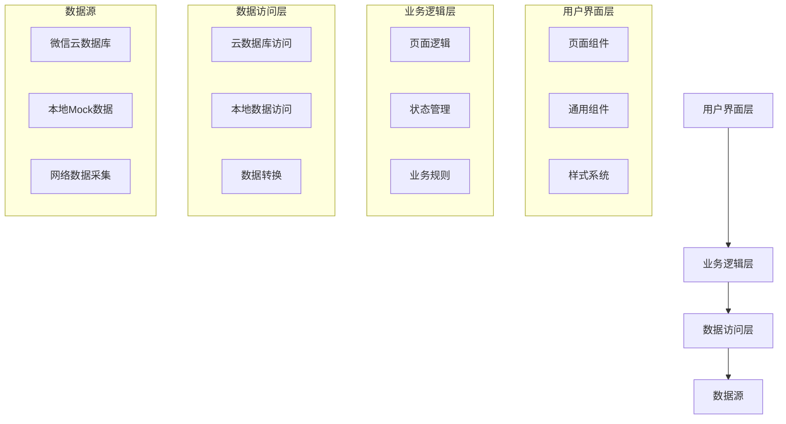

# 硬件助手 - 规范驱动开发（SDD）文档

> Specification-Driven Development for Hardware Assistant  
> 本文档是项目开发规范的总览，详细规范请查阅 [docs 目录](./docs/)

**文档版本**：v2.0.0  
**最后更新**：2026-02-06  
**维护者**：硬件助手开发团队

---

## 📚 文档导航

本项目采用**规范驱动开发（SDD）**方法论，完整的开发规范文档位于 `docs/` 目录：

### 核心文档

| 文档 | 说明 | 链接 |
|------|------|------|
| 📖 **产品需求文档** | 用户画像、功能需求、用户故事 | [docs/01-PRD.md](./docs/01-PRD.md) |
| 🎨 **设计系统** | UI/UX 规范、色彩、字体、组件 | [docs/02-DESIGN-SYSTEM.md](./docs/02-DESIGN-SYSTEM.md) |
| 🏗️ **架构设计** | 系统架构、模块设计、数据模型 | [docs/03-ARCHITECTURE.md](./docs/03-ARCHITECTURE.md) |
| 📝 **开发规范** | 编码规范、Git 规范、测试规范 | [docs/04-DEVELOPMENT-STANDARDS.md](./docs/04-DEVELOPMENT-STANDARDS.md) |
| ✅ **任务分解** | 里程碑、任务清单、进度跟踪 | [docs/05-TASKS.md](./docs/05-TASKS.md) |

### 参考文档

- [技术能力清单](./SKILLS.md) - 项目展示的核心技术能力
- [项目架构分析](./PROJECT_ARCHITECTURE_ANALYSIS.md) - 详细的架构分析

---

## 🎯 什么是规范驱动开发（SDD）？

规范驱动开发是一种**先定义规范、后编写代码**的开发方法论，核心理念：

```
需求分析 → 设计规范 → 开发规范 → 编码实现 → 测试验证
```

### SDD 的优势

✅ **减少返工**：明确需求后再开发，避免重复修改  
✅ **提高质量**：规范约束确保代码质量  
✅ **团队协作**：文档化降低沟通成本  
✅ **可维护性**：清晰的架构便于后期维护

---

## 1. 项目概述

### 1.1 项目背景
硬件助手是一个基于Uni-app + Vue 3 + TypeScript开发的微信小程序，旨在为用户提供全面、准确的硬件信息查询和对比功能。

### 1.2 核心功能
- **硬件信息查询**：支持CPU、显卡、手机等硬件的详细参数查询
- **硬件对比**：支持同类型硬件的参数对比
- **性能排行**：基于硬件参数计算的性能排行榜
- **数据更新通知**：及时通知用户数据库的更新情况
- **收藏功能**：支持用户收藏感兴趣的硬件

### 1.3 技术栈
- **前端框架**：Uni-app + Vue 3 (Composition API)
- **开发语言**：TypeScript
- **状态管理**：Pinia
- **UI组件库**：wot-design-uni
- **数据处理**：Python (数据采集、清洗、验证)
- **云服务**：微信云开发

---

## 2. 快速开始

### 2.1 阅读顺序（新成员）

如果你是新加入的开发者，建议按以下顺序阅读文档：

1. **首先**：阅读本文档（SDD.md）了解项目概况
2. **其次**：阅读 [PRD](./docs/01-PRD.md) 了解产品需求
3. **然后**：阅读 [ARCHITECTURE](./docs/03-ARCHITECTURE.md) 了解系统架构
4. **接着**：阅读 [DEVELOPMENT-STANDARDS](./docs/04-DEVELOPMENT-STANDARDS.md) 了解编码规范
5. **最后**：查看 [TASKS](./docs/05-TASKS.md) 领取开发任务

### 2.2 开发流程

```
需求评审（PRD） → 架构设计（ARCHITECTURE） → 任务分配（TASKS）
                                        ↓
                              遵循开发规范（STANDARDS）
                                        ↓
                         编码 → 测试 → Code Review → 合并
```

### 2.3 关键规范速查

#### TypeScript 规范
- ✅ 严格模式（零 `any` 类型）
- ✅ 所有函数参数和返回值明确类型
- ✅ 使用接口定义数据结构

#### 命名规范
- 变量/函数：`camelCase`
- 常量：`UPPER_SNAKE_CASE`
- 类型/接口：`PascalCase`
- Composable：`use` 前缀

#### Git 提交规范
```
<type>(<scope>): <subject>

类型：feat, fix, docs, style, refactor, perf, test, chore
示例：feat(ranking): 添加CPU子选项过滤功能
```

---

## 3. 系统架构概览

### 3.1 四层架构



### 3.2 核心模块

| 模块 | 职责 | 技术实现 | 位置 |
|------|------|----------|------|
| 数据访问 | 统一数据访问接口 | useCloudData composable | src/composables/useCloudData.ts |
| 状态管理 | 硬件对比状态管理 | Pinia Store | src/stores/compare.ts |
| 硬件信息 | 硬件详细信息展示 | 详情页面 | src/pages/detail/index.vue |
| 硬件对比 | 硬件参数对比 | 对比页面 | src/pages/compare/index.vue |
| 性能排行 | 硬件性能排行榜 | 排行页面 | src/pages/ranking/index.vue |
| 数据更新 | 数据更新通知 | 更新详情页面 | src/pages/update-detail/index.vue |
| 收藏功能 | 用户收藏管理 | 收藏页面 + Store | src/pages/favorites/index.vue |

### 3.3 数据流

1. **数据采集**：通过Python脚本从网络或本地文件采集硬件数据
2. **数据处理**：对采集的数据进行清洗、验证和标准化
3. **数据存储**：将处理后的数据存储到微信云数据库
4. **数据访问**：前端通过useCloudData composable访问云数据库数据
5. **数据展示**：将数据展示在各个页面组件中
6. **用户交互**：用户通过页面组件进行交互操作
7. **状态更新**：通过Pinia Store管理全局状态

> 📘 **详细架构设计**：查看 [docs/03-ARCHITECTURE.md](./docs/03-ARCHITECTURE.md)

---

## 4. 核心数据模型

### 4.1 类型定义

#### BaseHardware（基础硬件接口）

```typescript
interface BaseHardware {
  id: string;
  brand: string;
  model: string;
  price: number;
  releaseDate: string;
  description?: string;
}
```

#### CpuSpecs（CPU 接口）

#### CpuSpecs（CPU 接口）

```typescript
interface CpuSpecs extends BaseHardware {
  cores: string;
  baseClock: number;
  boostClock: number;
  socket: string;
  tdp: number;
  integratedGraphics: boolean;
  cache: number;
}
```

#### GpuSpecs（显卡接口）

```typescript
interface GpuSpecs extends BaseHardware {
  vram: number;
  cudaCores: number;
  coreClock: number;
  boostClock: number;
  rayTracing: boolean;
}
```

#### PhoneSpecs（手机接口）

```typescript
interface PhoneSpecs extends BaseHardware {
  ram: number;
  storage: number;
  screenSize: number;
  processor: string;
  batteryCapacity: number;
  support5G: boolean;
}
```

> 📘 **完整数据模型**：查看 [docs/03-ARCHITECTURE.md](./docs/03-ARCHITECTURE.md#4-数据模型设计)

---

## 5. 核心功能

## 5. 核心功能

### 5.1 功能优先级

| 优先级 | 功能 | 状态 |
|--------|------|------|
| P0 | 硬件信息查询 | ✅ 已完成 |
| P0 | 硬件详情展示 | ✅ 已完成 |
| P0 | 硬件参数对比 | ✅ 已完成 |
| P1 | 性能排行榜 | ✅ 已完成 |
| P1 | 收藏功能 | ✅ 已完成 |
| P2 | 数据更新通知 | ✅ 已完成 |

### 5.2 功能模块概览

#### 首页模块

#### 首页模块
- 硬件分类切换（CPU/GPU/手机）
- 硬件列表展示和分页加载
- 搜索功能（按型号、品牌）
- 数据更新通知标签

#### 详情页模块
- 硬件详细参数展示
- 性能评分计算
- 添加对比功能
- 收藏功能

#### 对比页模块
- 硬件参数对比表格
- 性能评分对比
- 参数差异高亮
- 移除/清空对比项

#### 排行页模块
- 性能排行榜（Top 20）
- CPU 子选项过滤（全部/桌面/移动）
- 前三名特殊标识（金银铜）
- 硬件类别切换

#### 收藏页模块
- 收藏列表展示
- 取消收藏
- 查看收藏详情

> 📘 **详细功能需求**：查看 [docs/01-PRD.md](./docs/01-PRD.md)

---

## 6. 开发规范速查
- 根据硬件类型展示不同的参数
- 计算硬件性能评分
- 集成Pinia Store实现对比和收藏功能

### 4.3 对比页模块

#### 4.3.1 功能描述
- 硬件参数对比
- 性能评分对比
- 移除对比项
- 清空对比列表

#### 4.3.2 技术实现
- 使用Pinia Store管理对比状态
- 实现硬件参数的表格对比
- 计算并展示性能评分对比
- 添加移除和清空功能

### 4.4 排行页模块

#### 4.4.1 功能描述
- 硬件性能排行榜
- 子选项过滤（如桌面/移动CPU）
- 排名展示

#### 4.4.2 技术实现
- 基于硬件参数计算性能评分
- 实现按评分排序
- 添加子选项过滤功能
- 展示排名和评分

### 4.5 更新详情页模块

#### 4.5.1 功能描述
- 数据更新通知展示
- 更新内容详情
- 返回首页功能

#### 4.5.2 技术实现
- 展示详细的更新信息
- 实现动画效果
- 添加返回首页按钮

### 4.6 收藏页模块

#### 4.6.1 功能描述
- 收藏列表展示
- 取消收藏
- 查看收藏详情

#### 4.6.2 技术实现
- 使用Pinia Store管理收藏状态
- 展示收藏的硬件列表
- 实现取消收藏功能
- 支持点击查看详情

## 5. 接口定义

### 5.1 页面路由

| 页面 | 路径 | 功能 | 参数 |
|------|------|------|------|
| 首页 | /pages/index/index | 硬件列表和搜索 | 无 |
| 详情页 | /pages/detail/index | 硬件详细信息 | id, type |
| 对比页 | /pages/compare/index | 硬件对比 | 无 |
| 排行页 | /pages/ranking/index | 性能排行 | 无 |
| 收藏页 | /pages/favorites/index | 收藏列表 | 无 |
| 更新详情页 | /pages/update-detail/index | 数据更新详情 | 无 |
| 我的页面 | /pages/profile/index | 个人中心 | 无 |

### 5.2 数据访问接口

#### 5.2.1 useCloudData composable

```typescript
// src/composables/useCloudData.ts
export function useCloudData<T>(collectionName: string, options?: CloudDataOptions) {
  const list = ref<T[]>([]);
  const loading = ref(false);
  const finished = ref(false);
  const error = ref<string | null>(null);
  const total = ref(0);
  
  // 刷新数据
  const refresh = async () => {};
  
  // 加载更多
  const loadMore = async () => {};
  
  // 搜索
  const search = async (keyword: string) => {};
  
  return {
    list,
    loading,
    finished,
    error,
    total,
    refresh,
    loadMore,
    search
  };
}
```

### 5.3 状态管理接口

#### 5.3.1 compare Store

```typescript
// src/stores/compare.ts
export const useCompareStore = defineStore('compare', {
  state: () => ({
    cpuList: [] as CompareItem[],
    gpuList: [] as CompareItem[],
    phoneList: [] as CompareItem[]
  }),
  
  getters: {
    totalCount: (state) => {
      return state.cpuList.length + state.gpuList.length + state.phoneList.length;
    },
    canStartPK: (state) => {
      return state.cpuList.length >= 2 || state.gpuList.length >= 2 || state.phoneList.length >= 2;
    }
  },
  
  actions: {
    toggleCompare(item: any) {},
    removeCompareItem(id: string, type: string) {},
    clearCompare() {}
  }
});
---

## 6. 开发规范速查

### 6.1 TypeScript 规范
```typescript
// ✅ 推荐：明确类型，零 any
interface CpuSpecs {
  cores: string;
  baseClock: number;
}

function getCpuData(): Promise<CpuSpecs[]> { }

// ❌ 禁止：使用 any
function getData(): any { }
```

### 6.2 Vue 组件规范
```vue
<script setup lang="ts">
// Props 定义
interface Props {
  id: string;
  type: 'cpu' | 'gpu' | 'phone';
}
const props = defineProps<Props>();

// Emits 定义
const emit = defineEmits<{
  (e: 'update', value: string): void;
}>();
</script>
```

### 6.3 命名规范
| 类型 | 规则 | 示例 |
|------|------|------|
| 变量/函数 | camelCase | `loadData`, `isActive` |
| 常量 | UPPER_SNAKE_CASE | `MAX_COUNT` |
| 类型/接口 | PascalCase | `CpuSpecs` |
| Composable | use 前缀 | `useCloudData` |
| 组件 | PascalCase | `HardwareCard` |

### 6.4 Git 提交规范
```bash
# 格式
<type>(<scope>): <subject>

# 示例
feat(ranking): 添加CPU子选项过滤功能
fix(detail): 修复性能评分计算错误
docs: 更新API文档
```

**Type 类型**：
- `feat`：新功能
- `fix`：Bug修复
- `docs`：文档更新
- `style`：代码格式
- `refactor`：重构
- `perf`：性能优化
- `test`：测试
- `chore`：构建/工具

> 📘 **完整开发规范**：查看 [docs/04-DEVELOPMENT-STANDARDS.md](./docs/04-DEVELOPMENT-STANDARDS.md)

---

## 7. 性能指标

### 7.1 性能目标

| 指标 | 目标值 | 测试方法 |
|------|--------|---------|
| 首屏加载时间 | < 2s | Lighthouse |
| 页面切换时间 | < 500ms | Performance API |
| 搜索响应时间 | < 300ms | Console.time |
| 列表滚动帧率 | ≥ 60fps | Chrome DevTools |
| 数据库查询 | < 100ms | 云函数日志 |

### 7.2 优化策略
- ✅ 分页加载（每页 20 条）
- ✅ 骨架屏优化加载体验
- ✅ 计算属性缓存（computed）
- ✅ 数据库索引优化
- 📋 虚拟滚动（计划中）
- 📋 图片懒加载（计划中）

---

## 8. 测试规范

### 8.1 测试覆盖率要求

| 模块 | 覆盖率 | 状态 |
|------|--------|------|
| Composables | ≥ 80% | 📋 计划中 |
| Stores | ≥ 80% | 📋 计划中 |
| Utils | ≥ 90% | 📋 计划中 |
| Components | ≥ 70% | 📋 计划中 |

### 8.2 测试工具
- **单元测试**：Vitest
- **端到端测试**：Cypress
- **性能测试**：Lighthouse
- **代码质量**：ESLint + TypeScript

---

## 9. 项目里程碑

### 9.1 已完成里程碑

| 里程碑 | 时间 | 状态 |
|--------|------|------|
| M1: 基础架构 | 第 1 周 | ✅ 完成 |
| M2: 核心功能 | 第 2-3 周 | ✅ 完成 |
| M3: 增强功能 | 第 4 周 | ✅ 完成 |

### 9.2 下一步计划

| 任务 | 优先级 | 状态 |
|------|--------|------|
| 单元测试覆盖 | P1 | 📋 计划中 |
| 虚拟滚动优化 | P2 | 📋 计划中 |
| 数据缓存机制 | P2 | 📋 计划中 |
| 深色模式支持 | P3 | 📋 计划中 |

> 📘 **完整任务清单**：查看 [docs/05-TASKS.md](./docs/05-TASKS.md)

---

## 10. 文档维护

### 10.1 文档更新规则

| 文档 | 更新时机 |
|------|----------|
| PRD | 需求变更时 |
| DESIGN-SYSTEM | UI/UX 调整时 |
| ARCHITECTURE | 架构变更时 |
| DEVELOPMENT-STANDARDS | 规范调整时 |
| TASKS | 任务计划变更时 |

### 10.2 变更日志

| 版本 | 日期 | 变更内容 |
|------|------|----------|
| v2.0.0 | 2026-02-06 | 重构为导航文档，创建完整 SDD 体系 |
| v1.0.0 | 2025-12-01 | 初始版本创建 |

---

## 11. 相关资源

### 11.1 官方文档
- [Uni-app 官方文档](https://uniapp.dcloud.net.cn/)
- [Vue 3 官方文档](https://cn.vuejs.org/)
- [TypeScript 官方文档](https://www.typescriptlang.org/)
- [微信小程序开发文档](https://developers.weixin.qq.com/miniprogram/dev/framework/)
- [wot-design-uni 组件库](https://wot-design-uni.netlify.app/)

### 11.2 项目文档
- [技术能力清单](./SKILLS.md)
- [项目架构分析](./PROJECT_ARCHITECTURE_ANALYSIS.md)
- [项目结构总结](./PROJECT_STRUCTURE_SUMMARY.md)

---

## 12. 联系与贡献

### 12.1 获取帮助
- 查看文档：优先查阅 `docs/` 目录下的详细文档
- 提交 Issue：在 GitHub 仓库提交问题
- 代码审查：通过 Pull Request 进行代码审查

### 12.2 贡献指南
1. Fork 项目
2. 创建功能分支 (`git checkout -b feature/AmazingFeature`)
3. 提交更改 (`git commit -m 'feat: Add some AmazingFeature'`)
4. 推送到分支 (`git push origin feature/AmazingFeature`)
5. 创建 Pull Request

### 12.3 代码审查清单
- [ ] 代码符合 TypeScript 严格模式
- [ ] 遵循命名规范
- [ ] Git 提交信息符合规范
- [ ] 功能完整，边界情况已处理
- [ ] 性能指标达标
- [ ] 添加必要的测试

---

**文档结束**

*本文档是规范驱动开发（SDD）体系的总览，详细规范请查阅 [docs 目录](./docs/)*

#### 6.4.1 前端错误处理
- 多层错误处理：页面层、Composable层、数据层
- 友好的错误提示：Toast提示、空状态引导
- 错误日志记录：控制台日志、远程日志
- 错误恢复机制：重试、降级策略

#### 6.4.2 后端错误处理
- 数据采集错误处理：重试、跳过、记录
- 数据处理错误处理：验证、清洗、转换
- 数据库操作错误处理：重试、回滚、记录

## 7. 测试计划

### 7.1 测试策略

- **单元测试**：测试各个组件和函数的功能
- **集成测试**：测试各个模块的集成功能
- **端到端测试**：测试完整的用户流程
- **性能测试**：测试应用的性能和响应时间
- **兼容性测试**：测试应用在不同设备和平台上的兼容性

### 7.2 测试用例

#### 7.2.1 首页测试
- 测试分类切换功能
- 测试搜索功能
- 测试数据加载状态
- 测试数据更新通知标签栏点击功能

#### 7.2.2 详情页测试
- 测试不同类型硬件的详情展示
- 测试添加对比功能
- 测试收藏功能
- 测试性能评分计算

#### 7.2.3 对比页测试
- 测试硬件参数对比
- 测试性能评分对比
- 测试移除对比项功能
- 测试清空对比列表功能

#### 7.2.4 排行页测试
- 测试性能排行榜功能
- 测试子选项过滤功能
- 测试排名展示

#### 7.2.5 更新详情页测试
- 测试更新信息展示
- 测试动画效果
- 测试返回首页功能

### 7.3 测试工具

- **单元测试**：Vitest
- **端到端测试**：Cypress
- **性能测试**：Lighthouse
- **代码质量**：ESLint + Prettier
- **类型检查**：TypeScript

## 8. 部署计划

### 8.1 开发环境

- **开发工具**：Visual Studio Code
- **构建工具**：Vite
- **包管理器**：pnpm
- **版本控制**：Git

### 8.2 构建流程

1. **代码检查**：运行ESLint和TypeScript类型检查
2. **单元测试**：运行单元测试
3. **构建**：使用Vite构建应用
4. **部署**：上传到微信小程序平台

### 8.3 部署步骤

1. **准备工作**：确保代码通过所有测试和检查
2. **构建应用**：运行`npm run build:mp-weixin`
3. **上传代码**：使用微信开发者工具上传构建后的代码
4. **提交审核**：在微信小程序后台提交审核
5. **发布上线**：审核通过后发布上线

### 8.4 版本管理

- 使用语义化版本号：MAJOR.MINOR.PATCH
- 每次发布都记录版本变更日志
- 定期备份代码和数据

## 9. 维护计划

### 9.1 数据维护

- 定期更新硬件数据
- 监控数据采集和处理过程
- 处理数据异常情况
- 优化数据存储和访问

### 9.2 代码维护

- 定期检查代码质量
- 修复bug和性能问题
- 优化代码结构和性能
- 添加新功能和改进现有功能

### 9.3 安全维护

- 定期检查安全漏洞
- 保护用户数据安全
- 防止恶意攻击
- 遵守相关法律法规

### 9.4 性能维护

- 监控应用性能
- 优化页面加载速度
- 减少网络请求
- 优化数据处理和渲染

## 10. 总结

硬件助手项目是一个基于Uni-app + Vue 3 + TypeScript开发的微信小程序，旨在为用户提供全面、准确的硬件信息查询和对比功能。通过规范驱动开发(SDD)，我们确保了项目的代码质量、功能完整性和可维护性。

本文档定义了项目的系统架构、数据模型、功能模块、接口定义、开发规范、测试计划、部署计划和维护计划，为项目的开发和维护提供了详细的指导。

通过严格遵循本文档定义的规范和标准，我们可以开发出高质量、高性能、用户友好的硬件助手应用，为用户提供更好的硬件信息查询和对比体验。